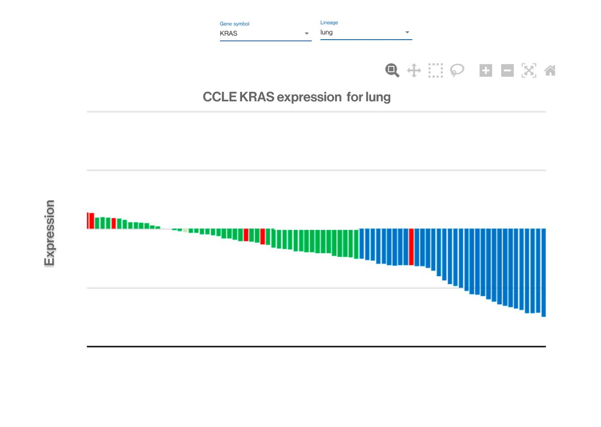

# Novartis

## Novartis Coding Challenge

## Introduction

Coding test for the position of Bioinformatics React Developer

### Download the sources

Please make sure you have installed NodeJS and NPM to run this APP

To download the sources you can clone the repository. For this to be done, open a terminal in your operating system and type:
```bash
git clone git@github.com:manudas/novartis-coding-test.git

```
Once you have downloaded the sources, you can build the assets or run the unit tests

### Build the assets
Open the folder you cloned before:
```bash
cd novartis-coding-test
```
If you are running the project for the first time, you need to install the dependencies:
```bash
npm install
```
Then run the following command:
```bash
npm start
```
Let the assets compile. Once you get this message:

> Compiled successfully!

You'll probably have your browser open and can see the application running. In case you haven't just type the following address into your browser, or click in the link bellow:

[http://localhost:3000/](http://localhost:3000/)

### Run the unit tests
In the same folder you cloned before, just run the following command:
```bash
npm test
```
All the contained unit tests will be run automatically

### Problem statement

#### Prerequisites

Get familiar with the input data, which were originally publicly available from DepMap https://depmap.org/portal/ and have been processed and formatted for you.

Unfortunately, there is no WS API available for these data.

* There are 2 files in the attached DepMap Assignment.zip:
    * samples.json
    * ccle_expression.json
* Look at samples.json file:
    * Each document is about a sample – a ‘DepMap_ID’ with its attributes: ‘lineage’, and ‘lineage_subtype’.
    * E.g., for the DepMap_ID ACH-001113, it has a lineage of lung, and a lineage_subtype of NSCLC.
* Look at ccle_expression.json, these are ‘results’ for the sample IDs:
    * Each document lists the ‘expression_value’ for a ‘gene_symbol’, for each ‘DepMap_ID’.
    * E.g., for the DepMap_ID ACH-001113, for the KRAS gene, its expression value is 4.6340123564.
    * The DepMap_ID corresponds to the samples.json DepMap_ID attribute.

You don’t need to really understand what ‘gene expression’ is about. Essentially, we have samples which have IDs, called DepMap_IDs. These samples have ordinary float values (the expression values) that correspond to different genes. You can consider that ‘gene’ or ‘gene symbol’ are meaning the same thing, that the terms are used interchangeably.

#### The assignment
Please spend a maximum of 2 hours on the following example user story and share your code via a repository for us to chat about during the interview, e.g. via GitHub.

_As a_ lab scientist
_I want_ to explore the CCLE expression data for ‘lung’ samples, for the ‘KRAS’ gene
_so that_ I can see what samples have high or low values.

#### Acceptance Criteria
* Make a new small React single page application using TypeScript to show a ‘bioinformatics waterfall plot’ – an ordered histogram - using the above data.
* See below for an example wireframe (not to be taken 100% 1:1 literally), with bars in a descending order.
* Use plotly.js for the histogram component https://plotly.com/javascript/
    * The x-axis should be about ‘lung’ cancer samples (the ‘lineage’)
    * The y-axis should be the expression values for those samples
    * Colour the bars according to their subtype (the ‘lineage_subtype’)
* There is no easy WS API available, the data should be stubbed out using the provided JSON files. Feel free to load, process, or convert data as needed.
* NB this is not a waterfall plot that you may find in other domains, e.g., finance, special density, etc.

#### Example wireframe


#### Bonus stretch goals suggestions
Here are some suggestions for further improvements. These are purely optional and not required. If you want to spend more time to explore and implement these ideas, please go ahead.
* Add a title to the plot
* Add a y-axis title
* Add a legend (for the colour of the subtypes)
* Add tooltips for the histogram when you hover over the bars and show the:
    * DepMap_ID
    * expression value
    * lineage
    * lineage_subtype
* Enhance the tooltip by adding an extra ‘gene description’. This information can be queried from the Ensembl Web Service API. See the ‘description’ field.
    * For KRAS: (https://rest.ensembl.org/lookup/id/ENSG00000133703?content-type=application/json "KRAS extra info")
    * Or for TP53: (https://rest.ensembl.org/lookup/id/ENSG00000141510?content-type=application/json "TP53 extra info")
* Have an option to choose a different gene, i.e. ‘KRAS’ or ‘TP53’. Use an appropriate Material UI component for this.
    * Then also have an ‘update plot’ button to redraw the plot based on the gene selection.
    * The tooltip would need updating accordingly as well.
* Have an option to choose a different lineage, i.e. ‘lung’, ‘blood’, or for ‘all lineages’ (both lung and blood together). Use an appropriate Material UI component for this.
    * The changes to the plot and tooltip should be also triggered with an ‘update plot’ button, similar to how a different gene can be selected and a new plot is drawn.